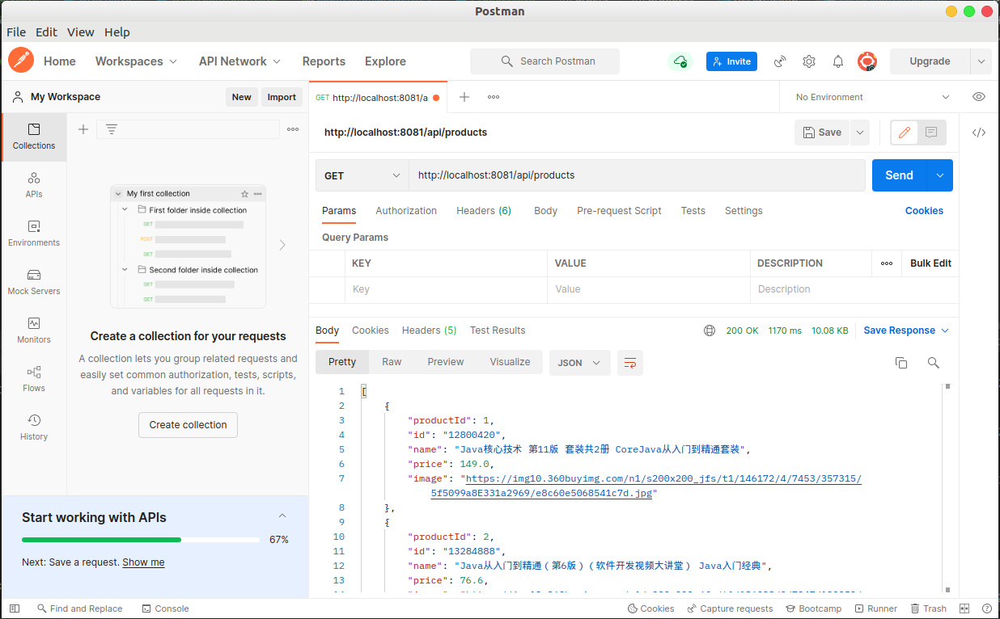
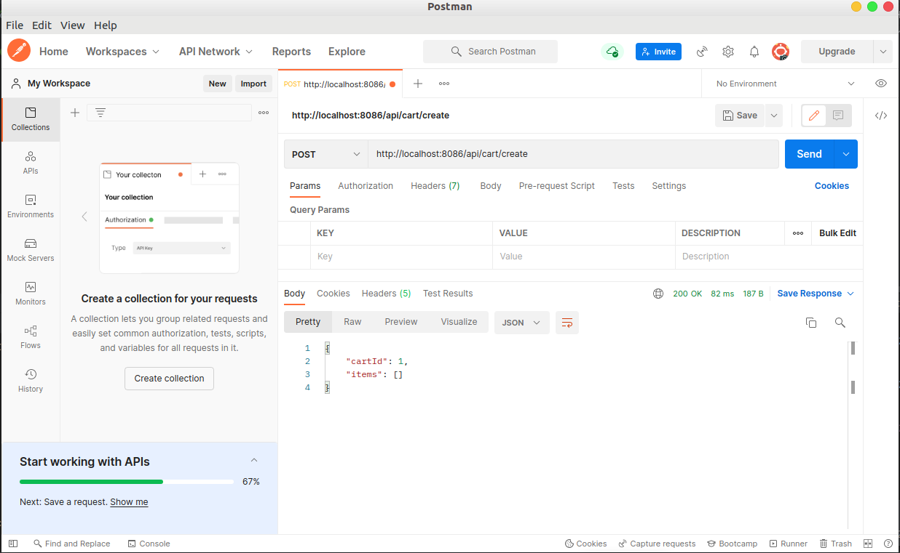
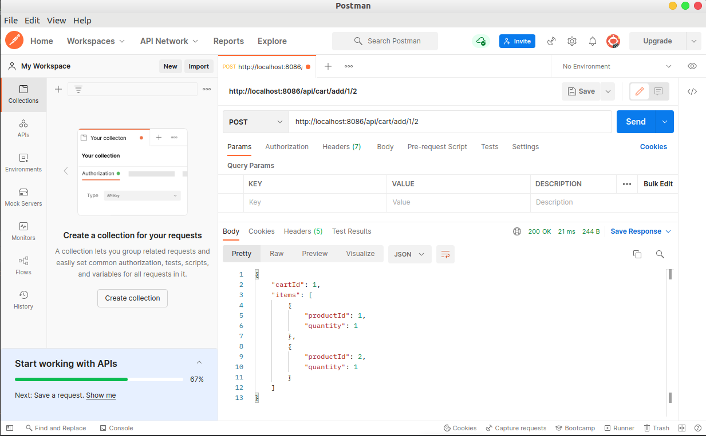
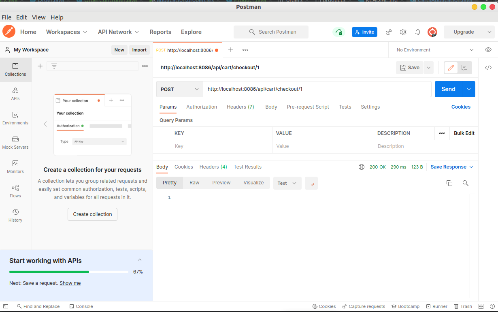
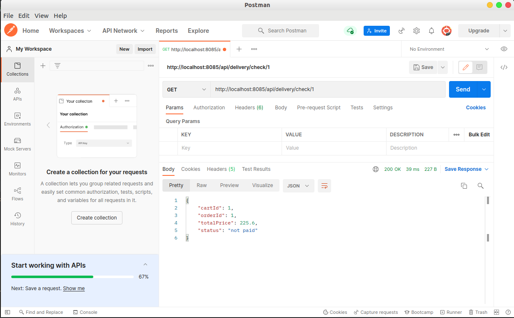

# aw07

## 实验报告

### 所做工作

#### 对AW05的重构

+ 使用jpa和mysql持久化products，cart
+ 因为jd的商品数据id大批量为null，amazon的数据集也大量缺少price，我新添一个productId用于数据库持久化。
+ 对于cart进行重设计，原先的一个getCart返回的是微服务内存中的唯一一个cart，换句话说，不仅不rest（因为状态由服务器保存），而且本身设计就不合理。新增加了cartId，Cart当中保存Item，Item只记录ProductId和数量。

#### AW07的工作

+ 在cart-service中新添checkout的url，用户可以通过指定购物车id进行结算，将cartDto通过streambridge传给delivery-service，后者注入一个Consumer\<Cart\>, 将cart转换成Order，计算价格并且持久化到数据库，并且提供通过CartId查询Order的接口。
+ 将counter业务集成到delivery-service上，通过消费送来的cart，拿取其中items，再查库计算。

#### 一些不足

+ 因为没有将openapi单独抽离，导致不少微服务都需要共享model。
+ 暴露的接口不够多（但是已经设计的都比较rest）

### 流程展示

+ 用docker启动rabbitmq，以及启动其他services
+ 启动四个微服务以及postman（没有启动网关，光是这四个我的电脑已经很卡了）
+ 查询商品
  
+ 创建购物车
  
+ 添加两个商品
  
+ 结算（偷懒，没有返回什么message）
  
+ 查询订单，可以看到已经算完了价格，显示当前状态为未支付
  

----

## 实验要求（原readme）

Please extend your MicroPOS system by adding a delivery service shown as the following figure.

When an order is placed by a user, the order serivce sends out an event into some AMQP MOM (such as RabbitMQ). The delivery service will be notified and a new delivery entry will be generated automatically. User can query the delivery status for his orders.

Use [Spring Cloud Stream](https://spring.io/projects/spring-cloud-stream) to make the scenerio happen. Of coz you can refer to the [demo](https://github.com/sa-spring/stream-loan) for technical details.